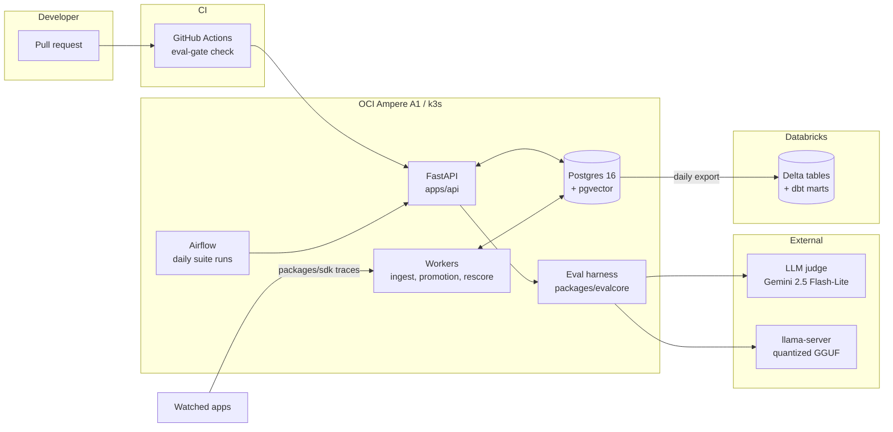

# EvalGate

[](https://github.com/starJin2003/EvalGate/actions/workflows/ci.yml)
<!-- P6: per-suite eval score badges served from Cloudflare Workers + R2 land here. -->

An LLM eval regression platform. It runs eval suites daily, harvests failing production
traces back into those suites, shows case-level diffs when scores drop, and blocks PR
merges through a GitHub Actions check.

Full brief in [BUILD_PLAN.md](BUILD_PLAN.md). Running log of decisions, problems, and
measured numbers in [DECISIONS.md](DECISIONS.md).

> **Status: P0 Bootstrap.** The scaffold, dev stack, and CI exist. The eval harness,
> API, and gate land in P1 through P3.

## Architecture

<!-- PLACEHOLDER. Replaced with the real component diagram in P1, per BUILD_PLAN section 10. -->



## Quickstart

Requires an arm64 machine (Apple Silicon or Ampere), [uv](https://docs.astral.sh/uv/),
and Docker with Compose.

```bash
# 1. Tooling (macOS)
brew install uv
brew install --cask orbstack   # or Docker Desktop

# 2. Clone and configure
git clone https://github.com/starJin2003/EvalGate.git
cd EvalGate
cp .env.example .env

# 3. Python workspace. uv fetches Python 3.12 itself; no system Python needed.
uv sync

# 4. Dev stack: Postgres 16 with pgvector
docker compose -f docker-compose.dev.yml up -d --wait

# 5. Verify the extension is live
docker compose -f docker-compose.dev.yml exec -T postgres \
  psql -U evalgate -d evalgate -tAc \
  "SELECT extversion FROM pg_extension WHERE extname = 'vector';"
# -> prints a version such as 0.8.1

# 6. Lint and test
uv run ruff check . && uv run ruff format --check .
uv run pytest
```

Optional, recommended once per clone:

```bash
uv run pre-commit install
```

Tear the stack down with `docker compose -f docker-compose.dev.yml down` (add `-v` to
drop the data volume and re-run the pgvector init script on next boot).

## Repo layout

| Path | What lives here | Phase |
|---|---|---|
| `apps/api/` | FastAPI service: suites, runs, diffs, traces, promotion | P1 |
| `packages/evalcore/` | Eval harness: suite schema, runner, scorers, judge client, diff | P1 |
| `packages/sdk/` | pip-installable trace client | P4 |
| `workers/` | Kafka consumer, promotion worker, judge rescore worker | P4 |
| `training/` | Data prep, Kaggle LoRA notebooks, GGUF convert and quantize | P1 |
| `infra/terraform/` | OCI provisioning | P2 |
| `infra/k8s/` | k3s manifests and helm values | P2 |
| `infra/postgres/init/` | Dev Postgres init SQL (pgvector) | P0 |
| `analytics/` | Export DAG helpers, Spark jobs, dbt project | P5 |
| `.github/workflows/` | `ci.yml` (lint, tests, dev stack), `eval-gate.yml` | P0, P3 |

## Development

| Task | Command |
|---|---|
| Install and update deps | `uv sync` |
| Run tests | `uv run pytest` |
| Lint | `uv run ruff check .` |
| Format | `uv run ruff format .` |
| Bring up the dev stack | `docker compose -f docker-compose.dev.yml up -d --wait` |

The repo is a uv workspace with a virtual root, so `uv sync` installs every member plus
the dev tooling in one shot. `apps/*` and `packages/*` are members; each has its own
`pyproject.toml`. Tooling config (ruff, pytest) is centralized in the root
`pyproject.toml`, and `uv.lock` is committed so CI can run `uv sync --locked`.

Everything targets **arm64 only** — an M1 Pro in dev, OCI Ampere A1 in prod, and
`ubuntu-24.04-arm` runners in CI.

## License

[MIT](LICENSE)
