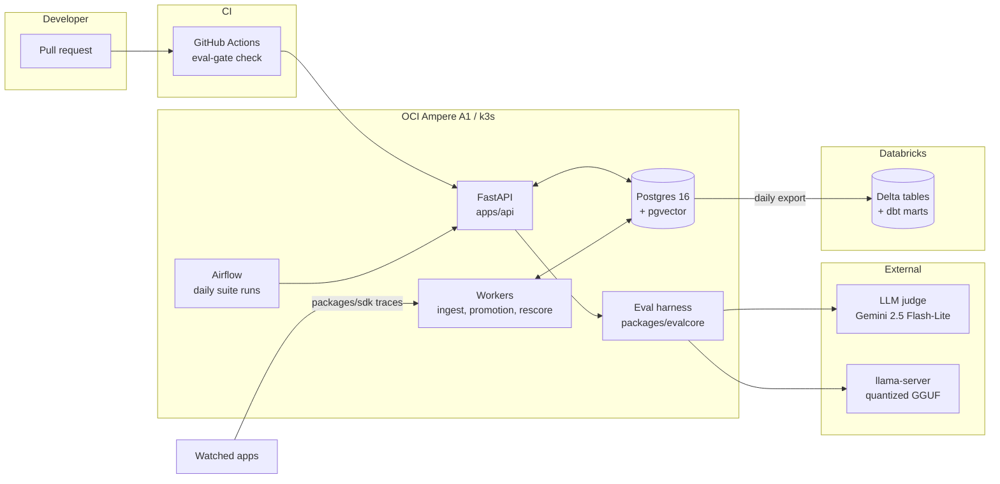

# EvalGate

[](https://github.com/starJin2003/EvalGate/actions/workflows/ci.yml)
<!-- P6: per-suite eval score badges served from Cloudflare Workers + R2 land here. -->

An LLM eval regression platform. It runs eval suites daily, harvests failing production
traces back into those suites, shows case-level diffs when scores drop, and blocks PR
merges through a GitHub Actions check.

Full brief in [BUILD_PLAN.md](BUILD_PLAN.md). Running log of decisions, problems, and
measured numbers in [DECISIONS.md](DECISIONS.md).

> **Status: P1.1 Data (teacher complete, hand review pending).** Corpus, questions,
> retrieval, and all 1,900 teacher answers are done — 97.6% valid, $2.89 of the $5.00
> ceiling. The 96-case golden sample is selected; hand review is the last step before
> P1.2. The P1.4 harness and the P3 gate are built and tested against stubbed model
> outputs. P1.2 (MLX LoRA on the M1) and P1.3 (GGUF + llama.cpp) are next; after them
> the only harness change is pointing the runner at a real endpoint.

## Architecture

<!-- PLACEHOLDER. Replaced with the real component diagram in P1, per BUILD_PLAN section 10. -->



## Deploy: one command

From a fresh clone plus credentials to a running public API:

```bash
./up.sh
```

It prints the URL and a `curl` when it finishes. On a live system it is a no-op
that takes about 45 seconds.

**What it needs first** — `up.sh` checks all of this before changing anything,
and names the exact file that is missing:

| | |
|---|---|
| Tools | `terraform`, `kubectl`, `ssh`, `scp`, `curl`, `tar`, `base64`. **No Docker** |
| `~/.oci/config` | `oci setup config`, then upload the public key in the console |
| `~/.aws/credentials` | An OCI **Customer Secret Key** under the profile named in `backend.hcl` — not the API signing key |
| `infra/terraform/terraform.tfvars` | From `terraform.tfvars.example`; `tenancy_ocid` and `admin_cidr` |
| `infra/terraform/backend.hcl` | From `backend.hcl.example`; your Object Storage namespace |
| SSH keypair | `ssh-keygen -t ed25519 -f ~/.ssh/evalgate_ed25519 -N ''` |

**What it does**, in order: `terraform apply` → wait for cloud-init's k3s → fetch
kubeconfig and open the SSH tunnel → prepare the node (disk, BuildKit, helm) →
generate any missing secrets → **build the API image on the node** → apply
Postgres, then monitoring, then the API → verify against the public address.

It is a composer. Every step is a script that already worked on its own; `up.sh`
supplies ordering, preconditions, and environment, and reimplements none of it.

**Three things worth knowing about it:**

*It exports `AWS_REQUEST_CHECKSUM_CALCULATION=when_required` itself.* Left to
your shell profile, the first terraform call fails with `403
SignatureDoesNotMatch` — an error that blames credentials and is actually a
streaming checksum trailer OCI does not implement. That should never have been a
README instruction.

*Secrets are generated when absent and never rotated.* The three out-of-band
credentials do not exist in a fresh clone, so `up.sh` creates them — into
mode-600 temp files passed to `kubectl --from-file`, so they never appear in
`ps`, in shell history, in the script's output, or anywhere under the repo. A
second run leaves them alone, because rotating a credential under a running
system is exactly how a "no-op" would break one. One case refuses instead: if
`postgres-credentials` is missing while the database exists, a new password could
not match it — `POSTGRES_PASSWORD` is read only by `initdb` on a first boot — so
the script stops and says so.

*Nothing is built on your machine.* The image is built on the node, natively for
its aarch64, with the build context streamed over SSH. `up.sh` will note that
Docker is installed if it finds it, and then not use it.

**Idempotence.** Running it again is a no-op: terraform reports `0 added, 0
changed, 0 destroyed`, every Kubernetes object reports `unchanged`, secrets
report `exists, leaving alone`, and no pod is replaced. The image build re-runs
but is a BuildKit cache hit producing the same digest, so `kubectl apply` sees no
diff. The one thing that increments is the helm release revision — a metadata
row, with identical rendered manifests.

**Not proven.** The zero-to-API path has never been executed end to end, and
cannot be from here: the instance is a free-tier `VM.Standard.A1.Flex` obtained
through a capacity lottery and is explicitly never to be destroyed. See
[PROGRESS.md](PROGRESS.md) for exactly which steps are exercised and which are
not.

---

## Local development quickstart

Requires an arm64 machine (Apple Silicon or Ampere), [uv](https://docs.astral.sh/uv/),
and Docker with Compose. This is the **local** stack for working on the code; it
is unrelated to `./up.sh`, which deploys to OCI.

```bash
# 1. Tooling (macOS)
brew install uv
brew install --cask orbstack   # or Docker Desktop

# 2. Clone and configure
git clone https://github.com/starJin2003/EvalGate.git
cd EvalGate
cp .env.example .env

# 3. Python workspace. uv fetches Python 3.12 itself; no system Python needed.
uv sync

# 4. Dev stack: Postgres 16 with pgvector
#    If you already run Postgres locally, set POSTGRES_PORT=5433 in .env first
#    (and match DATABASE_URL). A host listener on 5432 shadows the container's
#    port mapping, and connections fail with `role "evalgate" does not exist`.
docker compose -f docker-compose.dev.yml up -d --wait

# 5. Verify the extension is live
docker compose -f docker-compose.dev.yml exec -T postgres \
  psql -U evalgate -d evalgate -tAc \
  "SELECT extversion FROM pg_extension WHERE extname = 'vector';"
# -> prints a version such as 0.8.1

# 6. Lint and test
uv run ruff check . && uv run ruff format --check .
uv run pytest
```

Optional, recommended once per clone:

```bash
uv run pre-commit install
```

Tear the stack down with `docker compose -f docker-compose.dev.yml down` (add `-v` to
drop the data volume and re-run the pgvector init script on next boot).

## P1.1 — building the dataset

The training task is **grounded documentation QA**: answer only from supplied chunks,
cite every factual sentence, and refuse when the chunks do not contain the answer.
The corpus is four markdown-native docs repos for parts of this stack.

| Repo | Source | Chunks |
|---|---|---|
| FastAPI | `docs/en/docs` (English only) | 986 |
| Pydantic | `docs/` minus mkdocstrings stubs | 382 |
| Prometheus | `docs/` | 600 |
| Grafana | `docs/sources` | 4,210 |
| **Total** | | **6,178** (1.43M tokens) |

The corpus is 68% Grafana, so question generation does **not** sample proportionally.
Per-repo share is clamped into [15%, 35%] and the surplus from capped repos is
redistributed by corpus size, giving FastAPI 31.1% / Grafana 35.0% / Prometheus 18.9%
/ Pydantic 15.0%. Comparison and adversarial calls preferentially draw cross-repo
pairs, weighted toward Prometheus vs Grafana alerting — the confusable pair Grafana
was chosen for.

Requires `OPENAI_API_KEY` in `.env`. Every paid stage checks a cumulative ledger
first and **halts** at `OPENAI_USD_CEILING` rather than warning and continuing.

```bash
# Free stages
uv run evalgate-training corpus fetch          # shallow clone into training/.scratch/
uv run evalgate-training corpus parse          # -> artifacts/chunk_manifest.jsonl
uv run evalgate-training db init
uv run evalgate-training corpus load

# Paid stages, ~$1.20 total against a $5.00 ceiling
uv run evalgate-training corpus embed          # ~$0.03
uv run evalgate-training questions plan        # free: shows the stratified plan
uv run evalgate-training questions submit      # ~$0.29, Batch API
uv run evalgate-training questions poll --wait
uv run evalgate-training questions collect
uv run evalgate-training questions verify      # proves adversarial symbols are absent
uv run evalgate-training questions counts      # free: per-repo and per-category totals

uv run evalgate-training questions leak-report  # free: per-repo leak rate

# If verify's deletion pass leaves any (category, repo) cell short of its target:
uv run evalgate-training questions trim --dry-run   # free: preview surplus cells
uv run evalgate-training questions trim
uv run evalgate-training questions topup --round 1
uv run evalgate-training questions poll --round 1 --wait
uv run evalgate-training questions collect --round 1
uv run evalgate-training questions verify
uv run evalgate-training teacher retrieval     # top-k context per question
                                               # also reports retrieval span and
                                               # applies the pre-committed k rule
uv run evalgate-training teacher dry-run       # 20 items, ~$0.02  <-- STOP AND REVIEW

# Only after reading artifacts/dry_run_report.json.
# The Batch API caps enqueued tokens per model (5M for gpt-5-mini), and the full
# run is ~5.3M input alone, so it ships in shards. The cap is on in-flight work,
# so each part must finish before the next goes out. Repeat until nothing pends:
uv run evalgate-training teacher submit --approve-full-run
uv run evalgate-training teacher poll --wait
uv run evalgate-training teacher collect

uv run evalgate-training teacher audit         # free: the two poisoning rates
uv run evalgate-training golden select         # 96-case sample -> artifacts/golden_manifest.json
uv run evalgate-training golden review         # free, local: hand review, resumable
uv run evalgate-training golden review-export  # the same 96 cases, as data, for an outside reviewer
uv run evalgate-training golden export
uv run evalgate-training dataset export
uv run evalgate-training budget                # cumulative spend
```

### Hand review

Teacher output is not ground truth until a human agrees with it, so P1.1 does not
close until 96 cases have been read by hand.

`golden select` picks the sample: **6 cases per (category, repo) cell** across the
16 cells, drawn only from rows whose teacher answer passed validation, because
those are the rows P1.2 will actually train on. There is no RNG — rows are ordered
by `sha256(GOLDEN_SEED | question_id)`, so the sample is reproducible from the seed
string and rerunning `golden select` rewrites a byte-identical manifest. A cell with
fewer than 6 eligible rows is backfilled from elsewhere in the same category and the
shortfall is recorded in the manifest. The manifest is written **before** any review
happens, so the sample cannot be reshaped once verdicts start landing.

`golden review` serves the review UI on `127.0.0.1:8765`. It calls no model, judges
nothing, and summarises nothing: every word on screen is either the question, the
exact chunks the teacher was given (read back by chunk id, never re-retrieved), or
the teacher's answer verbatim. One case per screen, answer and chunks in two
independently scrolling panes, and each `[C3]` marker is a link that opens its chunk
in the other pane so a citation can be checked without a scroll hunt.

Each case gets a verdict and, when it fails, the **first** criterion it failed:

| # | Criterion | Fails when |
|---|---|---|
| 1 | completeness | the answer addresses only part of what was asked |
| 2 | groundedness | a claim is not supported by the retrieved chunks |
| 3 | refusal validity | it refused something answerable, or answered something it should have refused |
| 4 | citation accuracy | a marker points at a chunk that does not say that |

Keyboard: `p` passes, `1`–`4` fail on that criterion, `Enter` saves, arrows navigate.

Every judgment is appended to `artifacts/golden_review.jsonl` before the next case
loads, so quitting mid-review loses nothing and rerunning `golden review` reopens
the first unjudged case. The log is **append-only**: rejudging a case appends a
superseding record rather than editing the old one, so the log keeps the fact that
the reviewer changed their mind. `golden summary` prints pass rate overall, per
category, and per failed criterion, and writes the same numbers to
`artifacts/golden_review_summary.json` once all 96 are judged.

### Handing the sample to someone else

`golden review-export` writes the same 96 cases, in the same manifest order, as
JSONL instead of HTML, so the review can happen somewhere this repo is not:

```
artifacts/review_export.jsonl                     # 96 records, 1,082,249 chars
artifacts/review_batches/batch_01..08.jsonl       # the same records, 12 per file
```

Each record is `case_index` (1–96), `question_id`, `category`, `repo`, `question`,
`teacher_answer`, and `chunks` — 8 objects of `marker` (`C1`–`C8`), `title`, and the
full chunk `text`. Chunks are read back from the ids stored on the question row,
never re-retrieved, and never truncated.

What is **not** in the record is the point: no `valid`, no `validation_errors`, no
`refused`, no parsed citation list. Those are this pipeline's own opinion of the
answer, and a reviewer who sees them before reading is anchored by them — the
review would stop being an independent check on the validator. The record is built
from the same `Case` the UI renders, which has no field to leak them through.

The batch files concatenate back into the export byte for byte, which is asserted
on every run, so a batch cannot quietly drop or duplicate a case.

### Dataset-poisoning guards

Two teacher failure modes silently corrupt training data, so both are checked
mechanically and their rates are recorded in [DECISIONS.md](DECISIONS.md).

**Fabricating the absent side.** The teacher knows all four projects from
pretraining. When a comparison question's retrieval covers only one of them, the
prompt forbids supplying anything about the other, and `fabricated_absent_side`
flags any non-disclaimer sentence that names it anyway. A model distilled on those
rows would learn to invent the half it was not shown. Statements of absence are
exempt from the citation rule, since they cite nothing by construction.

**Failing to refuse.** Adversarial rows must actually decline. `answered_absent`
flags any adversarial row the teacher answered confidently. Those rows teach the
student not to refuse, which is the opposite of the behaviour being trained.

`teacher audit --regenerate` clears flagged answers so a re-submit regenerates
them; `--drop` deletes the questions outright. Regeneration is capped at
**2 attempts per row** — a case class the teacher systematically fails never
converges, and an uncapped audit/regenerate loop would resubmit it every round and
burn budget. Rows past the cap are dropped and counted. The attempt counter lives
on `questions`, not `teacher_answers`, so it survives the delete-and-resubmit cycle.

### Backfilling without drifting off the split

Adversarial deletions are **not** uniform across repos. Measured 2026-07-31 over
545 generated questions:

| Repo | Corpus chunks | Leak rate |
|---|---|---|
| Grafana | 4,210 | 34.2% |
| Pydantic | 382 | 27.5% |
| FastAPI | 986 | 20.6% |
| Prometheus | 600 | 19.0% |

Grafana confirms that collision probability tracks corpus density. Pydantic does
not: smallest corpus, second-highest rate, because its API naming is so regular
(`model_*`, `field_*`, `*_validator`) that plausible invented names land on real
symbols.

So top-ups backfill **per (category, repo) cell** against that cell's own target,
and over-request by `1.10 / (1 - that repo's leak rate)` rather than one global
factor. Backfilling in aggregate re-applies the global split to the gap and
over-fills repos that never lost rows. `questions trim` drops the surplus from
cells that overshot, preferring rows with no teacher answer so no paid work is
discarded.

### Retrieval k

`k` is a **pre-committed** rule, fixed before the numbers were measured. If fewer
than 50% of comparison questions retrieve chunks spanning 2+ repos, `k` rises to 8
**globally** — every category and eval — and is re-measured once. At or above 50%,
`k` stays 4 and the fabrication guard carries the load. `k` is never raised for one
category alone: training and eval must see identical retrieval.

`corpus fetch` shells out to `git clone --depth 1`. Pass `--method tarball` to fetch
over plain HTTPS instead, which works without a git binary.

**Committed vs not.** `training/.scratch/` holds the vendored docs and is gitignored.
`training/artifacts/` is committed: the chunk manifest (metadata only, no doc text),
the generated dataset, the golden set, and the spend ledger.

**The golden set is never trained on.** 96 cases, 6 per (category, repo) cell,
selected deterministically and frozen in `artifacts/golden_manifest.json` and
`artifacts/golden_ids.json`. `dataset export` raises if any golden id appears in the
training split, and a test asserts the same invariant. Hand-check them with
`golden review` — teacher output is not ground truth until reviewed.

## P1.2 — fine tuning on the M1 Pro

Status: prepared and verified, not yet trained. The dataset, the environment, and
the memory envelope are all measured; the full run has not been started.

MLX is Apple-Silicon-only, so it is **not** a dependency of the `training` package
and **not** in the `dev` group — CI runs `uv sync --locked` on `ubuntu-24.04-arm`,
where any hard dependency on it fails to resolve. It lives in its own group behind
a platform marker:

```bash
uv sync --group mlx                             # no-op off darwin/arm64
uv run evalgate-training dataset export         # needs Postgres up
docker compose -f docker-compose.dev.yml down   # then free the RAM
```

`dataset export` writes `artifacts/dataset/{train,valid,test}.jsonl` plus
`artifacts/dataset_manifest.json`. The three names are what `mlx_lm.lora --data`
expects, and `valid.jsonl` is required — MLX errors without it.

**Only the manifest is committed.** The rendered splits are gitignored: 23 MB, of
which ~95% is corpus chunk text repeated across examples, and `corpus fetch` +
`corpus parse` rebuild it deterministically for free (11.3 s + 3.4 s). The manifest
carries the per-split `question_id` lists and a sha256 of each rendered file, so
the split is reconstructible and a rebuild is provable:

```bash
uv run evalgate-training dataset export   # rebuild (needs Postgres)
uv run evalgate-training dataset verify   # prove it matches the committed manifest
```

**The paid state is backed up, and the backup is tested.** `artifacts/recovery.jsonl`
is 1,900 rows and 2.0 MB: every question and teacher answer, plus retrieved chunk
**ids**, and no chunk text. That is the half of P1.1 that cost $2.89 and cannot be
regenerated — a re-run of the Batch API returns *different* answers, which would
invalidate the hand review along with the data. Everything else rebuilds for free.

```bash
uv run evalgate-training dataset recovery-export                       # needs Postgres
uv run evalgate-training dataset restore                               # needs none
uv run evalgate-training dataset restore --target artifacts/dataset    # ...and this is
                                          # how P1.2 gets its inputs with the DB stopped
```

`restore` re-parses the corpus, cross-checks all 6,178 chunks against
`chunk_manifest.jsonl`, and fails unless the rebuilt splits are byte-identical to
`dataset_manifest.json`. An untested backup is a comment.

Committing rendered training text also means committing upstream documentation
verbatim, including whatever placeholder credentials it contains — a Grafana
`glsa_` example token in Grafana's own docs tripped GitHub push protection once.
CI checks golden-leak and pairwise disjointness from the manifest's id lists, which
needs no rendered text; `dataset verify` covers byte-level agreement locally.

**Splits.** 1,758 valid rows → train 1,478 / valid 140 / test 140, held out 8% + 8%
**per (category, repo) cell** rather than globally, so all 16 cells reach both
held-out splits. Assignment is `sha256(seed | question_id)`, the same
no-RNG scheme as `golden select`, so it survives a re-query or a row-order change.
The golden 96 are excluded from all three and disjointness is asserted at write
time and again in CI.

**Format** is mlx-lm's chat format. The `prompt`/`completion` format is read first
by `create_dataset` and rebuilds the turn as user+assistant only, which would
silently drop the teacher system prompt — where every distilled rule lives.

**Thinking mode is off automatically.** Qwen3's chat template emits an empty
`<think>\n\n</think>` block ahead of the assistant content for any full
conversation, regardless of `enable_thinking`. At inference, pass
`enable_thinking=False` to `apply_chat_template` (llama.cpp: the
`chat_template_kwargs` request field) to get the same shape.

**Memory is set by sequence length, not weight precision.** Peak GPU memory for one
LoRA step, measured, against a Metal recommended working set of **12.71 GB**:

| max_seq_len | 8-bit | 8-bit + `--grad-checkpoint` | bf16 + `--grad-checkpoint` |
|---|---|---|---|
| 4096 | 15.41 GB | 7.38 GB | 9.02 GB |
| 5120 | 19.41 GB | 8.87 GB | 10.42 GB |
| 6528 | 26.66 GB | **10.86 GB** | 12.55 GB |

Dropping bf16 → 8-bit saves ~1.6 GB; gradient checkpointing saves ~16 GB. Use
`--grad-checkpoint`. Longest example is 6,391 tokens, so 6528 truncates nothing.

**Truncation cuts the answer, not the context.** `iterate_batches` keeps
`tokens[:max_seq_length]`, and the answer is at the tail — so a too-small limit
trains the model to emit unterminated answers rather than to answer from unseen
chunks. At 4096 that would hit 220 of 1,758 rows (12.5%).

### Choosing a checkpoint

mlx-lm never picks one. The rule was written down **before either run started**
(DECISIONS 2026-08-02) and both versions are selected by it, unchanged:

> Candidates are every numbered checkpoint plus the final weights. Score each on
> the full 140-row valid split. Lowest full-split valid loss; if two are within
> 0.01, take the earlier one.

```bash
uv run evalgate-training train eval-adapters \
  --adapter-path training/artifacts/adapters-v2 \
  --data         training/artifacts/dataset-v2 \
  --progress-log training/artifacts/v2_eval_adapters.jsonl \
  --json-out     training/artifacts/v2_eval_adapters.json

uv run evalgate-training train select \
  --eval-json training/artifacts/v2_eval_adapters.json
```

**Pass `--adapter-path` explicitly, always.** Its default is the *probe*
directory, and a sweep that silently scores throwaway weights produces a
perfectly plausible table. That was one of two defects this command shipped with;
the other was a glob that matched `0002000_adapters.safetensors` but not the bare
`adapters.safetensors`, quietly dropping the final weights — an arm the rule names
explicitly and the one most likely to be assumed the default. Both are fixed, and
the result file now records the adapter directory, the data directory and the full
candidate list so none of it has to be inferred later.

**The in-training val number is not an input.** `evaluate` gets no seed, so each
in-training eval scores a different reshuffled ~18% subsample; the untrained model
alone moves 0.2053 between a subsample and the full split. Only
`eval-adapters` (`num_batches=-1`, whole split, one pass) is comparable.

**The selection is applied by `train select`, not by eye.** v1's winner cleared
the 0.01 band by 0.000230 — the margin at which hand arithmetic goes wrong, and at
which someone who wants a particular answer can find one. A test asserts the
implementation reproduces v1's published selection (iter 2000) from v1's committed
sweep, so it is validated against a decision that predates the code. The function
takes one run's losses and nothing else, which is what makes "choose the
checkpoint that maximises the v1→v2 gap" — explicitly barred — inexpressible
rather than merely discouraged.

Then stage the selected weights before fusing, which is its own trap:
`mlx_lm.fuse --adapter-path` takes a *directory* and hardcodes
`adapters.safetensors`, i.e. the **final** weights, not the selected checkpoint.
`training/scripts/stage_selected_adapter.sh` is the guard.

## P1.3 — serving

GGUF plus llama.cpp, because MLX cannot run on OCI Ampere: this is the production
path, not a local convenience. Pipeline proven end to end 2026-08-03; re-run it
against each selected adapter.

```bash
brew install llama.cpp                     # arm64 bottle; every binary is Mach-O arm64
uv run --group mlx python -c "from huggingface_hub import snapshot_download; \
  snapshot_download('mlx-community/Qwen3-1.7B-8bit')"   # once, with network — fuse needs
                                                        # a *complete* snapshot
# Stage the SELECTED checkpoint first, then fuse from the staging directory.
# NEVER point --adapter-path at adapters-v1/ or adapters-v2/: it takes a
# *directory* and hardcodes adapters.safetensors, which is the FINAL weights,
# not the checkpoint the rule selected. It would succeed and print nothing
# unusual. This README previously documented that exact wrong path.
./training/scripts/stage_selected_adapter.sh 2000 v1     # v2: 1200 v2

uv run --group mlx python -m mlx_lm fuse \
  --model mlx-community/Qwen3-1.7B-8bit \
  --adapter-path training/artifacts/adapters-v1-selected \
  --save-path training/.scratch/fused-v1-bf16 --dequantize

cd training/.scratch/llamacpp/llama.cpp-b10210
uv run --no-project --with-requirements requirements/requirements-convert_hf_to_gguf.txt \
  python convert_hf_to_gguf.py <fused dir> --outfile <out>.f16.gguf --outtype f16

llama-quantize <out>.f16.gguf <out>.Q4_K_M.gguf Q4_K_M
llama-server -m <out>.Q4_K_M.gguf -c 8192 --host 127.0.0.1 --port 8080
```

| stage | size |
|---|---|
| MLX 8-bit base | 1.8 GB |
| fused bf16 (`--dequantize`) | 3.2 GB |
| GGUF f16 | 3.44 GB |
| **Q4_K_M** | **1.03 GB** (5.12 BPW, 3.3x reduction) |

**Measured on an M1 Pro:** 84.0 tok/s generation, ~1,000 tok/s prefill, ~4.5 s for a
real case (~2,900-token prompt), so a 96-case suite is ~7 minutes of model time.

**The converter never goes in the project venv.** It pins `numpy~=1.26.4` and
`transformers==4.57.6`; the project runs numpy 2.5.1 and transformers 5.14.1 for
mlx-lm. `uv run --no-project --with-requirements` uses the pinned set once and
leaves nothing behind — which also keeps torch out of `uv.lock` and out of CI.

**Context is `-c 8192`, not 6528.** 6528 was the training *sequence* budget, prompt
plus answer; at serve time the prompt alone reaches 6,357 tokens. A prompt over the
limit returns HTTP 400 `exceed_context_size_error` naming both counts — it fails
loudly rather than truncating silently, which is what the harness needs.

**This artifact now runs in production.** The same GGUF is deployed to the OCI
node — see [The model server](#the-model-server) under P2. The numbers above are
the M1's; the node is CPU-only Ampere and roughly an order of magnitude slower,
which is why the eval DAG is a nightly batch rather than anything interactive.

## The gate (P1.4 + P3)

The harness is built against a stubbed model, so the whole merge-blocking path is
provable before a trained model exists. P1.3 swaps in a real llama-server endpoint
and nothing else changes.

```bash
uv run evalgate-eval build-suite \
  --golden training/artifacts/golden_set.jsonl --out artifacts/suite.json
uv run evalgate-eval run --suite artifacts/suite.json \
  --outputs outputs.json --out artifacts/candidate.json --judge
uv run evalgate-eval gate --suite artifacts/suite.json \
  --baseline artifacts/baseline.json --candidate artifacts/candidate.json \
  --comment comment.md --html report.html
# exit 0 passes, exit 1 blocks the merge
```

**Category thresholds are the point.** The v1→v2 training experiment is designed
to raise the overall average while the refusal category collapses. A gate that
watched only the average would green-light it. Every category is checked against a
threshold, and `category_thresholds` tightens specific ones.

**A threshold below the measurement quantum is not a threshold.** With 24 cases
per category, one case is 1/24 = 0.0417 of that category's score, so nothing
smaller than that can ever be observed. Adversarial used to carry
`max_drop: 0.01`, which reads like "tolerate a small drop" and can only mean
"tolerate nothing" — a promise written in a form that hides what it is. It is now
a `ZeroTolerance` rule counting regressed **cases** (`max_regressed_cases: 0`),
which says the same thing out loud and stays honest if the suite is ever resized.
`Suite` validation *rejects* any per-category `max_drop` under the quantum rather
than warning. comparison, factual and howto sit at **0.0833** — two cases — and
before this they had no thresholds at all, so the gate could not fail on them.

**Runs carry their provenance and the gate refuses to diff across it.** A run
records `backend` (declared with `--backend`, since nothing the server exposes
names it reliably), `quantization`, and `build_info` observed from llama-server.
`compare()` raises rather than diffing two runs whose backend or llama.cpp build
differ, naming both sides: identical weights across Metal and ggml CPU moved this
suite **0.004272** and changed 79 of 96 answers, which is the size of a real
category regression. Runs recorded before provenance existed compare as before.

Other decisions worth knowing: thresholds are **absolute** drops, not relative, so
a PR comment is defensible to someone who didn't write it. Baseline promotion is
**explicit** per (suite, branch) — auto-promoting the newest run on main would
rebase the target a regression was supposed to be measured against. An errored
case scores **0** rather than being skipped, so a model that crashes on its hardest
cases cannot post a higher average than one that answers them badly. Adversarial
cases are scored on refusal only, since a correct refusal cites nothing.

The judge is provider-abstracted with a SQLite cache keyed on case + output +
rubric + **judge version**, so changing the judge invalidates old verdicts instead
of silently mixing them. `eval-gate.yml` restores that cache across PRs, which is
what keeps the gate affordable on a zero-dollar budget.

### Two instruments: the daily run and the PR gate

They answer different questions and have separate configs on purpose
(`packages/evalcore/src/evalcore/gate_config.py`).

| | asks | costs |
|---|---|---|
| **daily run** | did model quality change? | 96 cases, ~2.9 h on the node |
| **PR gate** | did this diff break the instrument, and is the last measurement still good? | no inference by default, seconds |

A PR cannot change model weights, so re-running 96 cases per PR would spend 2.9 h
measuring something the PR almost never affects. Shrinking the suite to fit a
five-minute gate does not trade accuracy for speed, it destroys the resolution the
thresholds are written in — at 12 cases one case is a third of a category. So the
PR gate carries **no score thresholds at all**; it asserts the last daily verdict
passed and is recent (`evalgate-eval check-daily`). The narrow exception is a PR
touching `prompt.py`, `scorers.py` or `loader.py`, which moves every score and
escalates to a full run.

Schedule, deadline and staleness are **one** decision, not three:
`floor(staleness) = 24 h interval + 3.8 h worst-case duration = 27.8 h`. The bound
is 36 h, so one missed night does not block merges and two consecutive ones do.

### Deploying the daily DAG

DAGs are baked into the Airflow image, so a DAG edit is a build plus a rollout —
`helm upgrade` alone will not restart pods, because the tag never changes.

```bash
./infra/k8s/airflow/build-on-node.sh                    # ~20 s, native arm64
KUBECONFIG=~/.kube/evalgate.yaml \
  EVALGATE_NODE_SSH="ssh -i ~/.ssh/evalgate_ed25519 ubuntu@<node>" \
  ./infra/k8s/airflow/apply.sh
kubectl -n airflow rollout restart statefulset/airflow-scheduler \
  deployment/airflow-dag-processor deployment/airflow-api-server
```

Three preconditions the DAG does not create for itself:

- **the suite on the node** at `/var/lib/evalgate/eval/suite.json`, which the
  eval pod mounts readOnly from the same PVC as the hash-gated weights;
- **a baseline** at `/var/lib/evalgate/results/baseline/run_baseline.json`.
  Without one the gate prints "no baseline artifact; passing" and writes no
  verdict, so `publish-latest` records `unknown`. Promotion is deliberate — see
  the explicit-promotion argument above;
- **`20-evalgate-pod-rbac.yaml`**, applied by `apply.sh`. The chart's
  pod-launcher Role lives in the `airflow` namespace and the eval pods run in
  `evalgate`; a namespaced Role does not reach across.

Triggering it by hand, which is also how the pipeline is proved end to end:

```bash
kubectl -n airflow exec airflow-scheduler-0 -c scheduler -- \
  airflow dags trigger evalgate_daily_eval --run-id manual__proof \
    --logical-date "$(date -u -v-1M +%FT%T+00:00)"     # GNU date: -d '-1 min'
```

**Pass a logical date, and put it in the past.** A logical date in the future is
not scheduled until it arrives and then the run is closed out empty; a logical
date before the DAG's `start_date` creates no task instances at all. Both produce
a DAG run marked `success` that ran nothing.

## P2 — infrastructure, and the capacity lottery

The target node is one OCI `VM.Standard.A1.Flex` at 4 OCPU / 24 GB on Ubuntu
24.04 aarch64, with cloud-init installing k3s. Getting one is the hard part:
Ampere A1 free-tier capacity is a lottery, all three `us-chicago-1` ADs currently
answer `Out of capacity for shape VM.Standard.A1.Flex`, and retrying by hand is
how you trip the OCI rate limit.

So the retry is the infrastructure. `infra/terraform/retry-apply.sh` loops
`terraform apply`, cycles every AD the region reports, backs off far enough to
stay under the rate limit, and exits the moment an instance launches.

```bash
brew install terraform oci-cli
oci setup config                    # leave the passphrase EMPTY; the loop is unattended
# upload ~/.oci/oci_api_key_public.pem in the console, then:
oci iam availability-domain list --output table

cd infra/terraform
cp terraform.tfvars.example terraform.tfvars   # tenancy_ocid is the only required value
terraform init

nohup ./retry-apply.sh > /dev/null 2>&1 &
tail -f logs/retry-$(date -u +%Y%m%d).log
```

Three attempts 3 minutes apart, then a 15 minute pause — about 4 attempts an
hour, deliberately slow. Failures are classified: `capacity` advances to the next
AD, `throttle` **holds** the AD and backs off exponentially from 30 minutes
(being rate limited says nothing about whether that AD had capacity), and
anything unrecognised is fatal rather than retried forever.

**It will not downsize for you.** 2 OCPU / 12 GB is a real BUILD_PLAN
contingency, which makes it tempting once retries drag, but a smaller instance
that launches reads as success in the log while silently changing the capacity
assumption P4's Kafka sizing rests on. The wrapper exits 3 below 4 OCPU unless
`--allow-downsize` is passed.

The VCN and public subnet are **looked up, never created** — they already exist,
and the ingress rules go in an NSG on the instance VNIC so `terraform destroy`
leaves shared infrastructure exactly as it was found.

### Network exposure

| Port | Source | Why |
|---|---|---|
| 22 | operator `/32` | The only administrative entry point, and the transport for the kube API tunnel |
| 80, 443 | the internet | The traefik ingress. Public **by design**: the P3 gate is called by GitHub Actions runners, whose egress ranges cannot be usefully allowlisted |
| 6443 | **nobody** | No rule exists. The k3s control plane is not on the internet |

`admin_cidr` and `public_ingress_cidr` are separate variables that never
reference each other, so tightening SSH cannot take the public API offline and
opening the web ports cannot widen SSH. `admin_cidr` rejects `0.0.0.0/0` by
validation — the recovery path for a too-narrow value is the OCI console in a
browser, which never depends on SSH, so failing closed is the cheap direction.

`kubectl` reaches the API through an SSH tunnel; the node's kubeconfig already
points at `127.0.0.1:6443` and needs no editing:

```bash
eval "$(terraform output -raw fetch_kubeconfig_command)"   # once
eval "$(terraform output -raw kubectl_tunnel_command)"     # leave running
KUBECONFIG=~/.kube/evalgate.yaml kubectl get nodes -o wide  # another terminal
```

### State

Terraform state lives in **OCI Object Storage**, not on a laptop. The instance
took a capacity lottery to obtain, so a lost local state file would mean
terraform no longer knows it exists and recovery would be `terraform import` per
resource. The bucket is private and **versioned**, and S3-native locking is on,
verified by two concurrent plans producing `412 PreconditionFailed` on the loser.

OCI has no native Terraform backend, so this is the `s3` backend pointed at
Object Storage's S3-compatible API. One environment variable is mandatory:

```bash
export AWS_REQUEST_CHECKSUM_CALCULATION=when_required
```

Without it every state operation fails as `403 SignatureDoesNotMatch`, which
looks like a credential problem and is not — the AWS SDK is sending a streaming
checksum trailer OCI does not implement. Neither `skip_s3_checksum` in the
backend block nor the equivalent key in `~/.aws/config` substitutes for it.

Full design notes, the bucket setup, the console recovery path, and how to fix
the bootstrap on a running node are in
[infra/terraform/README.md](infra/terraform/README.md).

### Postgres on a block volume

The database gets its **own** 50 GB OCI block volume rather than sharing the
50 GB boot disk through k3s's default `local-path` class. The reason is that
this is one node: by the end of P4 the boot volume also carries containerd
images, the Prometheus TSDB, Airflow, and Kafka log segments, all of which grow
unattended — and the database is the one thing on the node that cannot be
regenerated from this repo. It is free either way. The tenancy's Always Free
allowance is 200 GB of block storage per AD, so 50 boot + 50 pgdata leaves
100 GB for Prometheus and Kafka later.

```bash
cd infra/terraform
export AWS_REQUEST_CHECKSUM_CALCULATION=when_required
terraform plan     # must read: 2 to add, 0 to change, 0 to destroy
terraform apply
```

**Check that plan line before applying.** `storage.tf` only ever *reads* the
instance (`.id` and `.availability_domain`), so a correct plan touches nothing
that exists. Anything other than `0 to change, 0 to destroy` means the instance
is in the blast radius, and this shape is a capacity lottery — the instance is
not reobtainable on demand and must never be replaced to pick up a config change.

Then prepare the disk, create the password secret by hand, and deploy:

```bash
# once per volume; refuses to format a disk that already has a filesystem
scp -i ~/.ssh/evalgate_ed25519 infra/k8s/postgres/node-volume-setup.sh ubuntu@<node-ip>:/tmp/
ssh -i ~/.ssh/evalgate_ed25519 ubuntu@<node-ip> 'sudo bash /tmp/node-volume-setup.sh'

export KUBECONFIG=~/.kube/evalgate.yaml
kubectl apply -f infra/k8s/postgres/00-namespace.yaml
kubectl -n evalgate create secret generic postgres-credentials \
  --from-literal=POSTGRES_USER=evalgate \
  --from-literal=POSTGRES_DB=evalgate \
  --from-literal=POSTGRES_PASSWORD="$(LC_ALL=C tr -dc 'A-Za-z0-9' < /dev/urandom | head -c 32)"

./infra/k8s/postgres/apply.sh
```

The secret is created out-of-band and **never** committed. This repo is public,
so a password in a manifest is a password in every fork of it, permanently.
`apply.sh` checks that the secret exists and fails rather than generating one —
generating it inside a repo script is the same leak one step removed, since the
value lands in shell history and in any CI log that runs it.

Deployed on 2026-08-03 in 62 s total: 41 s of `terraform apply`, ~6 s of disk
prep, 15 s to a Ready pod. Postgres 16.14 on `aarch64` with pgvector 0.8.6 — the
same versions as the dev compose stack. Persistence was proven rather than
assumed: a row written by one pod was read back after `kubectl delete pod
postgres-0`, from a pod with a new uid and `restartCount=0`, 9 s later.

The full runbook — connecting, rotating the password, growing the volume, and
the three independent guards on the data — is in
[infra/k8s/README.md](infra/k8s/README.md).

### The API, and building without a registry

`apps/api` runs on the same cluster, backed by that Postgres, and is public at
**http://64.181.195.241**.

k3s ships containerd, not Docker, and there is no registry in the budget or the
plan. So the image is built **on the node**, natively for its own aarch64, and
written straight into k3s's containerd:

```bash
./infra/k8s/api/node-build-setup.sh   # once: nerdctl + BuildKit on the node
./infra/k8s/api/build-on-node.sh      # ~24 s, streams the context over SSH
```

BuildKit runs with a containerd worker pointed at `/run/k3s/containerd/containerd.sock`
in namespace **`k8s.io`**, so a finished build is immediately visible to kubelet
with no `docker save`, no tarball, and no import step.

That namespace is the thing to get right. containerd namespaces are hard
isolation and kubelet only ever looks in `k8s.io` — an image built into `default`
is invisible to k3s while `ctr images list` still shows it sitting there. Two
more traps come with having no registry: `imagePullPolicy: Always` sends kubelet
to Docker Hub for an image that only exists locally, and **a `:latest` tag
implicitly forces `Always`** regardless of the manifest. Hence an explicit
`:0.1.0` tag with `IfNotPresent`, which also survives a later move to GHCR that
`Never` would not.

Nothing is built on the dev machine. It is an M1 with a 9-hour training run on
it, and an image build is exactly the memory and IO spike that has already cost
this project one run.

```bash
export KUBECONFIG=~/.kube/evalgate.yaml
kubectl -n evalgate create secret generic evalgate-api-token \
  --from-literal=EVALGATE_API_TOKEN="$(LC_ALL=C tr -dc 'A-Za-z0-9' < /dev/urandom | head -c 40)"

EVALGATE_NODE_SSH="ssh -i ~/.ssh/evalgate_ed25519 ubuntu@<node-ip>" ./infra/k8s/api/apply.sh
```

**Writes need a bearer token; reads do not.** `PUT /suites`, `POST /runs`, and
baseline promotion require `Authorization: Bearer $EVALGATE_API_TOKEN`;
`/health`, `/ready`, the read endpoints, and `/gate` are open, so k6 and the P3
demo need no credential. The port is public by design — the P3 gate is called by
GitHub Actions runners whose egress cannot be allowlisted — and an unauthenticated
write endpoint on a public port is a free database-filling service for anything
that scans it. With no token configured, writes return 503 rather than running
open. HTTP only for now: Let's Encrypt will not issue for a bare IP, so TLS waits
for a DNS name.

Deployed on 2026-08-03: 24 s build, 210 MB image, 6 s to 2/2 replicas Ready,
42 MiB per pod. Verified over the public internet — unauthenticated write 401,
authenticated write 201, and `POST /gate` returning `verdict: fail` with a −0.5
delta and a breach on `adversarial`, through traefik, two pods, Postgres, and the
block volume.

The state is in Postgres, and that was proven rather than assumed: the same data
read back **identically from both replicas individually**, which an in-memory
store could not do, then read back again over public HTTP after every API pod was
deleted.

### Monitoring, and what chart defaults would have cost

kube-prometheus-stack 88.1.3 runs on the same node, sized for a box that must
also hold Airflow in P3 and Kafka in P4. Every container gets explicit requests
and limits, because the chart sets **none at all** on Prometheus and none on
Grafana's two sidecars.

```bash
ssh -i ~/.ssh/evalgate_ed25519 ubuntu@<node-ip> 'sudo bash /tmp/node-helm-setup.sh'
EVALGATE_NODE_SSH="ssh -i ~/.ssh/evalgate_ed25519 ubuntu@<node-ip>" \
  ./infra/k8s/monitoring/apply.sh          # helm runs on the node, 84 s
```

Result: **592 MiB actual against 784 MiB requested**, 5 pods, no Alertmanager.
Node-wide that is 8% of memory requests — which is the useful finding, because it
says memory is *not* the binding constraint on the still-open Kafka sizing
question. CPU is: 4 OCPU, already 143% committed in limits.

**The instructive part was that switching subcharts off did not switch their
metrics off.** With `kubeApiServer` and `kubeEtcd` disabled, Prometheus still held
53,201 series and the ten largest metrics were `apiserver_*` and `etcd_*`
histograms — because k3s runs the apiserver, etcd, controller manager, and
kubelet in **one process**, whose `/metrics` serves all of them. The chart toggles
remove the separate scrape jobs; the series arrive through the kubelet scrape
regardless. A `metricRelabelings` drop on the kubelet ServiceMonitor is what
actually enforced the decision, taking ingest to **16,192 series** and the kubelet
job from 44,260 to 7,517.

Prometheus keeps 15 days **and** at most 8 GB on `local-path` over the boot
volume, not the Postgres block volume — metrics are regenerable and the block
allowance is worth keeping for P4. The size cap matters more than it looks:
local-path is a hostPath bind with no quota, so the PVC's declared capacity is
advisory and `retentionSize` is the only thing that actually stops the TSDB
filling the disk.

The API exposes Prometheus metrics on **port 9000**, which the Ingress does not
route — `/metrics` returns 404 from the internet and `up` to the ServiceMonitor.
Metrics are labelled by route template (`/suites/{suite_id}`), so a suite id can
never become its own time series.

`infra/k8s/monitoring/dashboards/evalgate.json` is committed: 13 panels over
request rate, p95 latency, 5xx rate, requests in flight, node CPU/RAM/disk/load,
and container memory against its limit. Every panel query was executed against
the Prometheus API before the dashboard was called done — there are no empty
panels. Grafana stays ClusterIP behind the SSH tunnel: there is no TLS on a bare
IP, and an admin login crossing the internet in cleartext is a worse trade than
the API's scoped write token.

Full runbook in [infra/k8s/README.md](infra/k8s/README.md).

### Load test

```bash
KUBECONFIG=~/.kube/evalgate.yaml ./infra/k6/seed.sh      # 1 suite, 2 runs, 1 baseline, all k6- prefixed
KUBECONFIG=~/.kube/evalgate.yaml ./infra/k6/run.sh       # 7m30s, foreground
KUBECONFIG=~/.kube/evalgate.yaml ./infra/k6/teardown.sh  # scoped DELETEs, counts asserted
```

**Result, 2026-08-03: 306,436 requests over 7m30s at 680.95 req/s, p95 192 ms,
p99 246 ms, 0 errors, 612,872/612,872 checks passed, 0 container restarts.** All
four thresholds were committed in `script.js` before the run and all four held.

| | Idle | Under load (50 VUs) |
|---|---|---|
| Node CPU | — | **74.9% peak, 72.4% mean** |
| Memory | 2,508 MB | **2,626 MB** |
| `load1` | 0.17 | **9.57** |
| iowait | — | 0.02% |

The shape is the interesting part: 306k requests moved memory by 118 MB while
driving load average from 0.17 to 9.57. **The API is CPU-bound and nowhere near
memory-bound**, and iowait at 0.02% says Postgres on the block volume was never
the constraint.

k6 runs **as a Job in the cluster**, not as a process on the host, and that is
the point rather than a convenience. The generator shares the node with the thing
it is measuring, so the reported node CPU is only interpretable if the two can be
told apart — a pod gets its own cgroup and cadvisor reports its CPU separately,
where a host process would be invisible to cadvisor and indistinguishable from
the API's. Measured at the peak: **k6 0.290 cores, API 1.761, Postgres 0.352** —
the generator was 12% of the namespace's CPU. The RPS is therefore a floor on
this API's capacity rather than a ceiling, but a lightly discounted one.

The mix is **reads only**. Writes are one-per-eval on this API and P4's volume
ingest goes through Kafka, so write throughput would inform nothing — and a
7½-minute write load would put tens of thousands of JSONB bodies on the block
volume holding the irreplaceable data. `/health` is excluded from the mix too:
it does no work, so including it would inflate RPS and pull the aggregate p95
down.

Teardown is three prefix-scoped `DELETE`s in foreign-key order with the row
counts asserted afterwards — **no `TRUNCATE`, no `DROP`, no `CASCADE`**. That is
written the way it is because a test fixture pointed at this same database
earlier and truncated rows it had not created.

### The model server

The last P2 build item, and the one that unblocks P3's daily DAG. llama.cpp
`b10210` compiled **on the node** for aarch64 — same pattern as the API and
Airflow images, no buildx, no QEMU — serving the Q4_K_M GGUF over an
OpenAI-compatible endpoint at `evalgate-model.evalgate.svc.cluster.local:8080`.

Full operational detail is in [`infra/k8s/README.md`](infra/k8s/README.md#model).
Three things worth pulling up to here, because each is a decision rather than a
configuration:

**The weights are on the boot volume, not the Postgres block volume.** They are
re-derivable — the committed adapters plus this pipeline reproduce the exact
sha256 — and the database is not, and has no backup. A 1 GB file that rebuilds
in 32 s does not belong inside the blast radius of the one volume that cannot be
lost. `node-model-setup.sh` refuses to run if the two resolve to the same device,
so this is enforced rather than remembered.

**The digest is verified twice, and the second time is on every pod start.** A
truncated 1 GB GGUF still loads and still answers; it just answers wrong. That
failure arrives at the eval harness disguised as a model regression, which is
the most expensive possible way to find a bad upload — so the initContainer
re-checks the hash against a ConfigMap generated from `gguf_manifest.json`, and
a mismatch is a refusal to start rather than a wrong score.

**The thread count is set explicitly, because the default is wrong here.**
Kubernetes does not virtualize `/proc/cpuinfo`: inside the pod
`Cpus_allowed_list` is `0-3`, so llama.cpp's auto-detect resolves to 4 threads,
while the CPU *limit* is a CFS quota of 250 ms per 100 ms period. Four compute
threads ask for 4000m against 2500m, and the excess is not paid as a smooth
slowdown — the quota runs out mid-period and every thread in the pod freezes,
including the one answering `/health`, while ggml's spin-barrier burns what
quota is left waiting at a barrier. The value in the manifest comes from a sweep
run inside that exact cgroup against a rule fixed before the numbers existed.

## Repo layout

| Path | What lives here | Phase |
|---|---|---|
| `apps/api/` | FastAPI v0: suites, runs, baseline promotion, `/diff`, `/gate` | P1.4 |
| `packages/evalcore/` | Eval harness: schema, scorers, judge + cache, runner, diff, reports, `evalgate-eval` CLI | P1.4 |
| `packages/sdk/` | pip-installable trace client | P4 |
| `workers/` | Kafka consumer, promotion worker, judge rescore worker | P4 |
| `training/` | Corpus parsing, question generation, retrieval, teacher answers | P1.1 |
| `infra/terraform/` | OCI provisioning, plus `retry-apply.sh` for the A1 capacity lottery | P2 |
| `infra/k8s/` | k3s manifests, helm values, and the committed Grafana dashboard | P2 |
| `infra/k8s/model/` | llama.cpp image built on the node, weight upload + digest gate, thread sweep | P2 |
| `infra/k6/` | Load test: script, in-cluster Job, seed and scoped teardown | P2 |
| `infra/postgres/init/` | Dev Postgres init SQL (pgvector) | P0 |
| `analytics/` | Export DAG helpers, Spark jobs, dbt project | P5 |
| `.github/workflows/` | `ci.yml` (lint, tests, dev stack), `eval-gate.yml` (the merge gate) | P0, P3 |

## Development

| Task | Command |
|---|---|
| Install and update deps | `uv sync` |
| Run tests | `uv run pytest` |
| Lint | `uv run ruff check .` |
| Format | `uv run ruff format .` |
| Bring up the dev stack | `docker compose -f docker-compose.dev.yml up -d --wait` |

The repo is a uv workspace with a virtual root, so `uv sync` installs every member plus
the dev tooling in one shot. `apps/*` and `packages/*` are members; each has its own
`pyproject.toml`. Tooling config (ruff, pytest) is centralized in the root
`pyproject.toml`, and `uv.lock` is committed so CI can run `uv sync --locked`.

Everything targets **arm64 only** — an M1 Pro in dev, OCI Ampere A1 in prod, and
`ubuntu-24.04-arm` runners in CI.

## License

[MIT](LICENSE)
