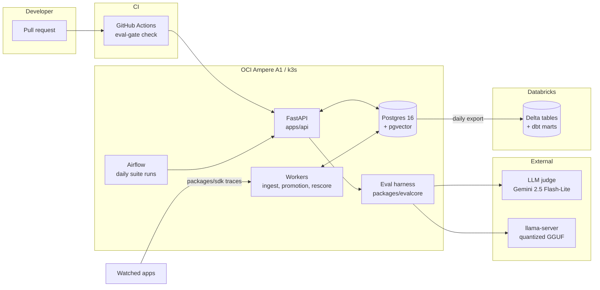

# EvalGate

[](https://github.com/starJin2003/EvalGate/actions/workflows/ci.yml)
<!-- P6: per-suite eval score badges served from Cloudflare Workers + R2 land here. -->

An LLM eval regression platform. It runs eval suites daily, harvests failing production
traces back into those suites, shows case-level diffs when scores drop, and blocks PR
merges through a GitHub Actions check.

Full brief in [BUILD_PLAN.md](BUILD_PLAN.md). Running log of decisions, problems, and
measured numbers in [DECISIONS.md](DECISIONS.md).

> **Status: P1.1 Data (teacher complete, hand review pending).** Corpus, questions,
> retrieval, and all 1,900 teacher answers are done — 97.6% valid, $2.89 of the $5.00
> ceiling. The 96-case golden sample is selected; hand review is the last step before
> P1.2. The P1.4 harness and the P3 gate are built and tested against stubbed model
> outputs. P1.2 (MLX LoRA on the M1) and P1.3 (GGUF + llama.cpp) are next; after them
> the only harness change is pointing the runner at a real endpoint.

## Architecture

<!-- PLACEHOLDER. Replaced with the real component diagram in P1, per BUILD_PLAN section 10. -->



## Quickstart

Requires an arm64 machine (Apple Silicon or Ampere), [uv](https://docs.astral.sh/uv/),
and Docker with Compose.

```bash
# 1. Tooling (macOS)
brew install uv
brew install --cask orbstack   # or Docker Desktop

# 2. Clone and configure
git clone https://github.com/starJin2003/EvalGate.git
cd EvalGate
cp .env.example .env

# 3. Python workspace. uv fetches Python 3.12 itself; no system Python needed.
uv sync

# 4. Dev stack: Postgres 16 with pgvector
#    If you already run Postgres locally, set POSTGRES_PORT=5433 in .env first
#    (and match DATABASE_URL). A host listener on 5432 shadows the container's
#    port mapping, and connections fail with `role "evalgate" does not exist`.
docker compose -f docker-compose.dev.yml up -d --wait

# 5. Verify the extension is live
docker compose -f docker-compose.dev.yml exec -T postgres \
  psql -U evalgate -d evalgate -tAc \
  "SELECT extversion FROM pg_extension WHERE extname = 'vector';"
# -> prints a version such as 0.8.1

# 6. Lint and test
uv run ruff check . && uv run ruff format --check .
uv run pytest
```

Optional, recommended once per clone:

```bash
uv run pre-commit install
```

Tear the stack down with `docker compose -f docker-compose.dev.yml down` (add `-v` to
drop the data volume and re-run the pgvector init script on next boot).

## P1.1 — building the dataset

The training task is **grounded documentation QA**: answer only from supplied chunks,
cite every factual sentence, and refuse when the chunks do not contain the answer.
The corpus is four markdown-native docs repos for parts of this stack.

| Repo | Source | Chunks |
|---|---|---|
| FastAPI | `docs/en/docs` (English only) | 986 |
| Pydantic | `docs/` minus mkdocstrings stubs | 382 |
| Prometheus | `docs/` | 600 |
| Grafana | `docs/sources` | 4,210 |
| **Total** | | **6,178** (1.43M tokens) |

The corpus is 68% Grafana, so question generation does **not** sample proportionally.
Per-repo share is clamped into [15%, 35%] and the surplus from capped repos is
redistributed by corpus size, giving FastAPI 31.1% / Grafana 35.0% / Prometheus 18.9%
/ Pydantic 15.0%. Comparison and adversarial calls preferentially draw cross-repo
pairs, weighted toward Prometheus vs Grafana alerting — the confusable pair Grafana
was chosen for.

Requires `OPENAI_API_KEY` in `.env`. Every paid stage checks a cumulative ledger
first and **halts** at `OPENAI_USD_CEILING` rather than warning and continuing.

```bash
# Free stages
uv run evalgate-training corpus fetch          # shallow clone into training/.scratch/
uv run evalgate-training corpus parse          # -> artifacts/chunk_manifest.jsonl
uv run evalgate-training db init
uv run evalgate-training corpus load

# Paid stages, ~$1.20 total against a $5.00 ceiling
uv run evalgate-training corpus embed          # ~$0.03
uv run evalgate-training questions plan        # free: shows the stratified plan
uv run evalgate-training questions submit      # ~$0.29, Batch API
uv run evalgate-training questions poll --wait
uv run evalgate-training questions collect
uv run evalgate-training questions verify      # proves adversarial symbols are absent
uv run evalgate-training questions counts      # free: per-repo and per-category totals

uv run evalgate-training questions leak-report  # free: per-repo leak rate

# If verify's deletion pass leaves any (category, repo) cell short of its target:
uv run evalgate-training questions trim --dry-run   # free: preview surplus cells
uv run evalgate-training questions trim
uv run evalgate-training questions topup --round 1
uv run evalgate-training questions poll --round 1 --wait
uv run evalgate-training questions collect --round 1
uv run evalgate-training questions verify
uv run evalgate-training teacher retrieval     # top-k context per question
                                               # also reports retrieval span and
                                               # applies the pre-committed k rule
uv run evalgate-training teacher dry-run       # 20 items, ~$0.02  <-- STOP AND REVIEW

# Only after reading artifacts/dry_run_report.json.
# The Batch API caps enqueued tokens per model (5M for gpt-5-mini), and the full
# run is ~5.3M input alone, so it ships in shards. The cap is on in-flight work,
# so each part must finish before the next goes out. Repeat until nothing pends:
uv run evalgate-training teacher submit --approve-full-run
uv run evalgate-training teacher poll --wait
uv run evalgate-training teacher collect

uv run evalgate-training teacher audit         # free: the two poisoning rates
uv run evalgate-training golden select         # 96-case sample -> artifacts/golden_manifest.json
uv run evalgate-training golden review         # free, local: hand review, resumable
uv run evalgate-training golden review-export  # the same 96 cases, as data, for an outside reviewer
uv run evalgate-training golden export
uv run evalgate-training dataset export
uv run evalgate-training budget                # cumulative spend
```

### Hand review

Teacher output is not ground truth until a human agrees with it, so P1.1 does not
close until 96 cases have been read by hand.

`golden select` picks the sample: **6 cases per (category, repo) cell** across the
16 cells, drawn only from rows whose teacher answer passed validation, because
those are the rows P1.2 will actually train on. There is no RNG — rows are ordered
by `sha256(GOLDEN_SEED | question_id)`, so the sample is reproducible from the seed
string and rerunning `golden select` rewrites a byte-identical manifest. A cell with
fewer than 6 eligible rows is backfilled from elsewhere in the same category and the
shortfall is recorded in the manifest. The manifest is written **before** any review
happens, so the sample cannot be reshaped once verdicts start landing.

`golden review` serves the review UI on `127.0.0.1:8765`. It calls no model, judges
nothing, and summarises nothing: every word on screen is either the question, the
exact chunks the teacher was given (read back by chunk id, never re-retrieved), or
the teacher's answer verbatim. One case per screen, answer and chunks in two
independently scrolling panes, and each `[C3]` marker is a link that opens its chunk
in the other pane so a citation can be checked without a scroll hunt.

Each case gets a verdict and, when it fails, the **first** criterion it failed:

| # | Criterion | Fails when |
|---|---|---|
| 1 | completeness | the answer addresses only part of what was asked |
| 2 | groundedness | a claim is not supported by the retrieved chunks |
| 3 | refusal validity | it refused something answerable, or answered something it should have refused |
| 4 | citation accuracy | a marker points at a chunk that does not say that |

Keyboard: `p` passes, `1`–`4` fail on that criterion, `Enter` saves, arrows navigate.

Every judgment is appended to `artifacts/golden_review.jsonl` before the next case
loads, so quitting mid-review loses nothing and rerunning `golden review` reopens
the first unjudged case. The log is **append-only**: rejudging a case appends a
superseding record rather than editing the old one, so the log keeps the fact that
the reviewer changed their mind. `golden summary` prints pass rate overall, per
category, and per failed criterion, and writes the same numbers to
`artifacts/golden_review_summary.json` once all 96 are judged.

### Handing the sample to someone else

`golden review-export` writes the same 96 cases, in the same manifest order, as
JSONL instead of HTML, so the review can happen somewhere this repo is not:

```
artifacts/review_export.jsonl                     # 96 records, 1,082,249 chars
artifacts/review_batches/batch_01..08.jsonl       # the same records, 12 per file
```

Each record is `case_index` (1–96), `question_id`, `category`, `repo`, `question`,
`teacher_answer`, and `chunks` — 8 objects of `marker` (`C1`–`C8`), `title`, and the
full chunk `text`. Chunks are read back from the ids stored on the question row,
never re-retrieved, and never truncated.

What is **not** in the record is the point: no `valid`, no `validation_errors`, no
`refused`, no parsed citation list. Those are this pipeline's own opinion of the
answer, and a reviewer who sees them before reading is anchored by them — the
review would stop being an independent check on the validator. The record is built
from the same `Case` the UI renders, which has no field to leak them through.

The batch files concatenate back into the export byte for byte, which is asserted
on every run, so a batch cannot quietly drop or duplicate a case.

### Dataset-poisoning guards

Two teacher failure modes silently corrupt training data, so both are checked
mechanically and their rates are recorded in [DECISIONS.md](DECISIONS.md).

**Fabricating the absent side.** The teacher knows all four projects from
pretraining. When a comparison question's retrieval covers only one of them, the
prompt forbids supplying anything about the other, and `fabricated_absent_side`
flags any non-disclaimer sentence that names it anyway. A model distilled on those
rows would learn to invent the half it was not shown. Statements of absence are
exempt from the citation rule, since they cite nothing by construction.

**Failing to refuse.** Adversarial rows must actually decline. `answered_absent`
flags any adversarial row the teacher answered confidently. Those rows teach the
student not to refuse, which is the opposite of the behaviour being trained.

`teacher audit --regenerate` clears flagged answers so a re-submit regenerates
them; `--drop` deletes the questions outright. Regeneration is capped at
**2 attempts per row** — a case class the teacher systematically fails never
converges, and an uncapped audit/regenerate loop would resubmit it every round and
burn budget. Rows past the cap are dropped and counted. The attempt counter lives
on `questions`, not `teacher_answers`, so it survives the delete-and-resubmit cycle.

### Backfilling without drifting off the split

Adversarial deletions are **not** uniform across repos. Measured 2026-07-31 over
545 generated questions:

| Repo | Corpus chunks | Leak rate |
|---|---|---|
| Grafana | 4,210 | 34.2% |
| Pydantic | 382 | 27.5% |
| FastAPI | 986 | 20.6% |
| Prometheus | 600 | 19.0% |

Grafana confirms that collision probability tracks corpus density. Pydantic does
not: smallest corpus, second-highest rate, because its API naming is so regular
(`model_*`, `field_*`, `*_validator`) that plausible invented names land on real
symbols.

So top-ups backfill **per (category, repo) cell** against that cell's own target,
and over-request by `1.10 / (1 - that repo's leak rate)` rather than one global
factor. Backfilling in aggregate re-applies the global split to the gap and
over-fills repos that never lost rows. `questions trim` drops the surplus from
cells that overshot, preferring rows with no teacher answer so no paid work is
discarded.

### Retrieval k

`k` is a **pre-committed** rule, fixed before the numbers were measured. If fewer
than 50% of comparison questions retrieve chunks spanning 2+ repos, `k` rises to 8
**globally** — every category and eval — and is re-measured once. At or above 50%,
`k` stays 4 and the fabrication guard carries the load. `k` is never raised for one
category alone: training and eval must see identical retrieval.

`corpus fetch` shells out to `git clone --depth 1`. Pass `--method tarball` to fetch
over plain HTTPS instead, which works without a git binary.

**Committed vs not.** `training/.scratch/` holds the vendored docs and is gitignored.
`training/artifacts/` is committed: the chunk manifest (metadata only, no doc text),
the generated dataset, the golden set, and the spend ledger.

**The golden set is never trained on.** 96 cases, 6 per (category, repo) cell,
selected deterministically and frozen in `artifacts/golden_manifest.json` and
`artifacts/golden_ids.json`. `dataset export` raises if any golden id appears in the
training split, and a test asserts the same invariant. Hand-check them with
`golden review` — teacher output is not ground truth until reviewed.

## P1.2 — fine tuning on the M1 Pro

Status: prepared and verified, not yet trained. The dataset, the environment, and
the memory envelope are all measured; the full run has not been started.

MLX is Apple-Silicon-only, so it is **not** a dependency of the `training` package
and **not** in the `dev` group — CI runs `uv sync --locked` on `ubuntu-24.04-arm`,
where any hard dependency on it fails to resolve. It lives in its own group behind
a platform marker:

```bash
uv sync --group mlx                             # no-op off darwin/arm64
uv run evalgate-training dataset export         # needs Postgres up
docker compose -f docker-compose.dev.yml down   # then free the RAM
```

`dataset export` writes `artifacts/dataset/{train,valid,test}.jsonl` plus
`artifacts/dataset_manifest.json`. The three names are what `mlx_lm.lora --data`
expects, and `valid.jsonl` is required — MLX errors without it.

**Only the manifest is committed.** The rendered splits are gitignored: 23 MB, of
which ~95% is corpus chunk text repeated across examples, and `corpus fetch` +
`corpus parse` rebuild it deterministically for free (11.3 s + 3.4 s). The manifest
carries the per-split `question_id` lists and a sha256 of each rendered file, so
the split is reconstructible and a rebuild is provable:

```bash
uv run evalgate-training dataset export   # rebuild (needs Postgres)
uv run evalgate-training dataset verify   # prove it matches the committed manifest
```

Committing rendered training text also means committing upstream documentation
verbatim, including whatever placeholder credentials it contains — a Grafana
`glsa_` example token in Grafana's own docs tripped GitHub push protection once.
CI checks golden-leak and pairwise disjointness from the manifest's id lists, which
needs no rendered text; `dataset verify` covers byte-level agreement locally.

**Splits.** 1,758 valid rows → train 1,478 / valid 140 / test 140, held out 8% + 8%
**per (category, repo) cell** rather than globally, so all 16 cells reach both
held-out splits. Assignment is `sha256(seed | question_id)`, the same
no-RNG scheme as `golden select`, so it survives a re-query or a row-order change.
The golden 96 are excluded from all three and disjointness is asserted at write
time and again in CI.

**Format** is mlx-lm's chat format. The `prompt`/`completion` format is read first
by `create_dataset` and rebuilds the turn as user+assistant only, which would
silently drop the teacher system prompt — where every distilled rule lives.

**Thinking mode is off automatically.** Qwen3's chat template emits an empty
`<think>\n\n</think>` block ahead of the assistant content for any full
conversation, regardless of `enable_thinking`. At inference, pass
`enable_thinking=False` to `apply_chat_template` (llama.cpp: the
`chat_template_kwargs` request field) to get the same shape.

**Memory is set by sequence length, not weight precision.** Peak GPU memory for one
LoRA step, measured, against a Metal recommended working set of **12.71 GB**:

| max_seq_len | 8-bit | 8-bit + `--grad-checkpoint` | bf16 + `--grad-checkpoint` |
|---|---|---|---|
| 4096 | 15.41 GB | 7.38 GB | 9.02 GB |
| 5120 | 19.41 GB | 8.87 GB | 10.42 GB |
| 6528 | 26.66 GB | **10.86 GB** | 12.55 GB |

Dropping bf16 → 8-bit saves ~1.6 GB; gradient checkpointing saves ~16 GB. Use
`--grad-checkpoint`. Longest example is 6,391 tokens, so 6528 truncates nothing.

**Truncation cuts the answer, not the context.** `iterate_batches` keeps
`tokens[:max_seq_length]`, and the answer is at the tail — so a too-small limit
trains the model to emit unterminated answers rather than to answer from unseen
chunks. At 4096 that would hit 220 of 1,758 rows (12.5%).

## The gate (P1.4 + P3)

The harness is built against a stubbed model, so the whole merge-blocking path is
provable before a trained model exists. P1.3 swaps in a real llama-server endpoint
and nothing else changes.

```bash
uv run evalgate-eval build-suite \
  --golden training/artifacts/golden_set.jsonl --out artifacts/suite.json
uv run evalgate-eval run --suite artifacts/suite.json \
  --outputs outputs.json --out artifacts/candidate.json --judge
uv run evalgate-eval gate --suite artifacts/suite.json \
  --baseline artifacts/baseline.json --candidate artifacts/candidate.json \
  --comment comment.md --html report.html
# exit 0 passes, exit 1 blocks the merge
```

**Category thresholds are the point.** The v1→v2 training experiment is designed
to raise the overall average while the refusal category collapses. A gate that
watched only the average would green-light it. Every category is checked against a
threshold; `category_thresholds` tightens specific ones, and adversarial carries
both a tighter drop limit and a score floor.

Other decisions worth knowing: thresholds are **absolute** drops, not relative, so
a PR comment is defensible to someone who didn't write it. Baseline promotion is
**explicit** per (suite, branch) — auto-promoting the newest run on main would
rebase the target a regression was supposed to be measured against. An errored
case scores **0** rather than being skipped, so a model that crashes on its hardest
cases cannot post a higher average than one that answers them badly. Adversarial
cases are scored on refusal only, since a correct refusal cites nothing.

The judge is provider-abstracted with a SQLite cache keyed on case + output +
rubric + **judge version**, so changing the judge invalidates old verdicts instead
of silently mixing them. `eval-gate.yml` restores that cache across PRs, which is
what keeps the gate affordable on a zero-dollar budget.

## P2 — infrastructure, and the capacity lottery

The target node is one OCI `VM.Standard.A1.Flex` at 4 OCPU / 24 GB on Ubuntu
24.04 aarch64, with cloud-init installing k3s. Getting one is the hard part:
Ampere A1 free-tier capacity is a lottery, all three `us-chicago-1` ADs currently
answer `Out of capacity for shape VM.Standard.A1.Flex`, and retrying by hand is
how you trip the OCI rate limit.

So the retry is the infrastructure. `infra/terraform/retry-apply.sh` loops
`terraform apply`, cycles every AD the region reports, backs off far enough to
stay under the rate limit, and exits the moment an instance launches.

```bash
brew install terraform oci-cli
oci setup config                    # leave the passphrase EMPTY; the loop is unattended
# upload ~/.oci/oci_api_key_public.pem in the console, then:
oci iam availability-domain list --output table

cd infra/terraform
cp terraform.tfvars.example terraform.tfvars   # tenancy_ocid is the only required value
terraform init

nohup ./retry-apply.sh > /dev/null 2>&1 &
tail -f logs/retry-$(date -u +%Y%m%d).log
```

Three attempts 3 minutes apart, then a 15 minute pause — about 4 attempts an
hour, deliberately slow. Failures are classified: `capacity` advances to the next
AD, `throttle` **holds** the AD and backs off exponentially from 30 minutes
(being rate limited says nothing about whether that AD had capacity), and
anything unrecognised is fatal rather than retried forever.

**It will not downsize for you.** 2 OCPU / 12 GB is a real BUILD_PLAN
contingency, which makes it tempting once retries drag, but a smaller instance
that launches reads as success in the log while silently changing the capacity
assumption P4's Kafka sizing rests on. The wrapper exits 3 below 4 OCPU unless
`--allow-downsize` is passed.

The VCN and public subnet are **looked up, never created** — they already exist,
and the ingress rules go in an NSG on the instance VNIC so `terraform destroy`
leaves shared infrastructure exactly as it was found.

### Network exposure

| Port | Source | Why |
|---|---|---|
| 22 | operator `/32` | The only administrative entry point, and the transport for the kube API tunnel |
| 80, 443 | the internet | The traefik ingress. Public **by design**: the P3 gate is called by GitHub Actions runners, whose egress ranges cannot be usefully allowlisted |
| 6443 | **nobody** | No rule exists. The k3s control plane is not on the internet |

`admin_cidr` and `public_ingress_cidr` are separate variables that never
reference each other, so tightening SSH cannot take the public API offline and
opening the web ports cannot widen SSH. `admin_cidr` rejects `0.0.0.0/0` by
validation — the recovery path for a too-narrow value is the OCI console in a
browser, which never depends on SSH, so failing closed is the cheap direction.

`kubectl` reaches the API through an SSH tunnel; the node's kubeconfig already
points at `127.0.0.1:6443` and needs no editing:

```bash
eval "$(terraform output -raw fetch_kubeconfig_command)"   # once
eval "$(terraform output -raw kubectl_tunnel_command)"     # leave running
KUBECONFIG=~/.kube/evalgate.yaml kubectl get nodes -o wide  # another terminal
```

### State

Terraform state lives in **OCI Object Storage**, not on a laptop. The instance
took a capacity lottery to obtain, so a lost local state file would mean
terraform no longer knows it exists and recovery would be `terraform import` per
resource. The bucket is private and **versioned**, and S3-native locking is on,
verified by two concurrent plans producing `412 PreconditionFailed` on the loser.

OCI has no native Terraform backend, so this is the `s3` backend pointed at
Object Storage's S3-compatible API. One environment variable is mandatory:

```bash
export AWS_REQUEST_CHECKSUM_CALCULATION=when_required
```

Without it every state operation fails as `403 SignatureDoesNotMatch`, which
looks like a credential problem and is not — the AWS SDK is sending a streaming
checksum trailer OCI does not implement. Neither `skip_s3_checksum` in the
backend block nor the equivalent key in `~/.aws/config` substitutes for it.

Full design notes, the bucket setup, the console recovery path, and how to fix
the bootstrap on a running node are in
[infra/terraform/README.md](infra/terraform/README.md).

## Repo layout

| Path | What lives here | Phase |
|---|---|---|
| `apps/api/` | FastAPI v0: suites, runs, baseline promotion, `/diff`, `/gate` | P1.4 |
| `packages/evalcore/` | Eval harness: schema, scorers, judge + cache, runner, diff, reports, `evalgate-eval` CLI | P1.4 |
| `packages/sdk/` | pip-installable trace client | P4 |
| `workers/` | Kafka consumer, promotion worker, judge rescore worker | P4 |
| `training/` | Corpus parsing, question generation, retrieval, teacher answers | P1.1 |
| `infra/terraform/` | OCI provisioning, plus `retry-apply.sh` for the A1 capacity lottery | P2 |
| `infra/k8s/` | k3s manifests and helm values | P2 |
| `infra/postgres/init/` | Dev Postgres init SQL (pgvector) | P0 |
| `analytics/` | Export DAG helpers, Spark jobs, dbt project | P5 |
| `.github/workflows/` | `ci.yml` (lint, tests, dev stack), `eval-gate.yml` (the merge gate) | P0, P3 |

## Development

| Task | Command |
|---|---|
| Install and update deps | `uv sync` |
| Run tests | `uv run pytest` |
| Lint | `uv run ruff check .` |
| Format | `uv run ruff format .` |
| Bring up the dev stack | `docker compose -f docker-compose.dev.yml up -d --wait` |

The repo is a uv workspace with a virtual root, so `uv sync` installs every member plus
the dev tooling in one shot. `apps/*` and `packages/*` are members; each has its own
`pyproject.toml`. Tooling config (ruff, pytest) is centralized in the root
`pyproject.toml`, and `uv.lock` is committed so CI can run `uv sync --locked`.

Everything targets **arm64 only** — an M1 Pro in dev, OCI Ampere A1 in prod, and
`ubuntu-24.04-arm` runners in CI.

## License

[MIT](LICENSE)
