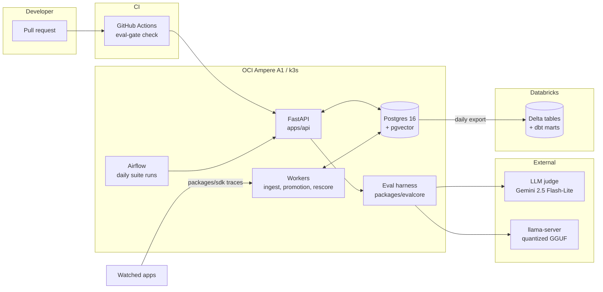

# EvalGate

[](https://github.com/starJin2003/EvalGate/actions/workflows/ci.yml)
<!-- P6: per-suite eval score badges served from Cloudflare Workers + R2 land here. -->

An LLM eval regression platform. It runs eval suites daily, harvests failing production
traces back into those suites, shows case-level diffs when scores drop, and blocks PR
merges through a GitHub Actions check.

Full brief in [BUILD_PLAN.md](BUILD_PLAN.md). Running log of decisions, problems, and
measured numbers in [DECISIONS.md](DECISIONS.md).

> **Status: P1.1 Data.** Scaffold, dev stack, and CI are green. The dataset pipeline
> is built and the corpus is parsed; teacher generation is gated on an approval step.
> Training, serving, and the gate land in P1.2 through P3.

## Architecture

<!-- PLACEHOLDER. Replaced with the real component diagram in P1, per BUILD_PLAN section 10. -->



## Quickstart

Requires an arm64 machine (Apple Silicon or Ampere), [uv](https://docs.astral.sh/uv/),
and Docker with Compose.

```bash
# 1. Tooling (macOS)
brew install uv
brew install --cask orbstack   # or Docker Desktop

# 2. Clone and configure
git clone https://github.com/starJin2003/EvalGate.git
cd EvalGate
cp .env.example .env

# 3. Python workspace. uv fetches Python 3.12 itself; no system Python needed.
uv sync

# 4. Dev stack: Postgres 16 with pgvector
#    If you already run Postgres locally, set POSTGRES_PORT=5433 in .env first
#    (and match DATABASE_URL). A host listener on 5432 shadows the container's
#    port mapping, and connections fail with `role "evalgate" does not exist`.
docker compose -f docker-compose.dev.yml up -d --wait

# 5. Verify the extension is live
docker compose -f docker-compose.dev.yml exec -T postgres \
  psql -U evalgate -d evalgate -tAc \
  "SELECT extversion FROM pg_extension WHERE extname = 'vector';"
# -> prints a version such as 0.8.1

# 6. Lint and test
uv run ruff check . && uv run ruff format --check .
uv run pytest
```

Optional, recommended once per clone:

```bash
uv run pre-commit install
```

Tear the stack down with `docker compose -f docker-compose.dev.yml down` (add `-v` to
drop the data volume and re-run the pgvector init script on next boot).

## P1.1 — building the dataset

The training task is **grounded documentation QA**: answer only from supplied chunks,
cite every factual sentence, and refuse when the chunks do not contain the answer.
The corpus is four markdown-native docs repos for parts of this stack.

| Repo | Source | Chunks |
|---|---|---|
| FastAPI | `docs/en/docs` (English only) | 986 |
| Pydantic | `docs/` minus mkdocstrings stubs | 382 |
| Prometheus | `docs/` | 600 |
| Grafana | `docs/sources` | 4,210 |
| **Total** | | **6,178** (1.43M tokens) |

The corpus is 68% Grafana, so question generation does **not** sample proportionally.
Per-repo share is clamped into [15%, 35%] and the surplus from capped repos is
redistributed by corpus size, giving FastAPI 31.1% / Grafana 35.0% / Prometheus 18.9%
/ Pydantic 15.0%. Comparison and adversarial calls preferentially draw cross-repo
pairs, weighted toward Prometheus vs Grafana alerting — the confusable pair Grafana
was chosen for.

Requires `OPENAI_API_KEY` in `.env`. Every paid stage checks a cumulative ledger
first and **halts** at `OPENAI_USD_CEILING` rather than warning and continuing.

```bash
# Free stages
uv run evalgate-training corpus fetch          # shallow clone into training/.scratch/
uv run evalgate-training corpus parse          # -> artifacts/chunk_manifest.jsonl
uv run evalgate-training db init
uv run evalgate-training corpus load

# Paid stages, ~$1.20 total against a $5.00 ceiling
uv run evalgate-training corpus embed          # ~$0.03
uv run evalgate-training questions plan        # free: shows the stratified plan
uv run evalgate-training questions submit      # ~$0.29, Batch API
uv run evalgate-training questions poll --wait
uv run evalgate-training questions collect
uv run evalgate-training questions verify      # proves adversarial symbols are absent
uv run evalgate-training questions counts      # free: per-repo and per-category totals

uv run evalgate-training questions leak-report  # free: per-repo leak rate

# If verify's deletion pass leaves any (category, repo) cell short of its target:
uv run evalgate-training questions trim --dry-run   # free: preview surplus cells
uv run evalgate-training questions trim
uv run evalgate-training questions topup --round 1
uv run evalgate-training questions poll --round 1 --wait
uv run evalgate-training questions collect --round 1
uv run evalgate-training questions verify
uv run evalgate-training teacher retrieval     # top-k context per question
                                               # also reports retrieval span and
                                               # applies the pre-committed k rule
uv run evalgate-training teacher dry-run       # 20 items, ~$0.02  <-- STOP AND REVIEW

# Only after reading artifacts/dry_run_report.json
uv run evalgate-training teacher submit --approve-full-run   # ~$0.86
uv run evalgate-training teacher poll --wait
uv run evalgate-training teacher collect

uv run evalgate-training teacher audit         # free: the two poisoning rates
uv run evalgate-training golden select && uv run evalgate-training golden export
uv run evalgate-training dataset export
uv run evalgate-training budget                # cumulative spend
```

### Dataset-poisoning guards

Two teacher failure modes silently corrupt training data, so both are checked
mechanically and their rates are recorded in [DECISIONS.md](DECISIONS.md).

**Fabricating the absent side.** The teacher knows all four projects from
pretraining. When a comparison question's retrieval covers only one of them, the
prompt forbids supplying anything about the other, and `fabricated_absent_side`
flags any non-disclaimer sentence that names it anyway. A model distilled on those
rows would learn to invent the half it was not shown. Statements of absence are
exempt from the citation rule, since they cite nothing by construction.

**Failing to refuse.** Adversarial rows must actually decline. `answered_absent`
flags any adversarial row the teacher answered confidently. Those rows teach the
student not to refuse, which is the opposite of the behaviour being trained.

`teacher audit --regenerate` clears flagged answers so a re-submit regenerates
them; `--drop` deletes the questions outright. Regeneration is capped at
**2 attempts per row** — a case class the teacher systematically fails never
converges, and an uncapped audit/regenerate loop would resubmit it every round and
burn budget. Rows past the cap are dropped and counted. The attempt counter lives
on `questions`, not `teacher_answers`, so it survives the delete-and-resubmit cycle.

### Backfilling without drifting off the split

Adversarial deletions are **not** uniform across repos. Measured 2026-07-31 over
545 generated questions:

| Repo | Corpus chunks | Leak rate |
|---|---|---|
| Grafana | 4,210 | 34.2% |
| Pydantic | 382 | 27.5% |
| FastAPI | 986 | 20.6% |
| Prometheus | 600 | 19.0% |

Grafana confirms that collision probability tracks corpus density. Pydantic does
not: smallest corpus, second-highest rate, because its API naming is so regular
(`model_*`, `field_*`, `*_validator`) that plausible invented names land on real
symbols.

So top-ups backfill **per (category, repo) cell** against that cell's own target,
and over-request by `1.10 / (1 - that repo's leak rate)` rather than one global
factor. Backfilling in aggregate re-applies the global split to the gap and
over-fills repos that never lost rows. `questions trim` drops the surplus from
cells that overshot, preferring rows with no teacher answer so no paid work is
discarded.

### Retrieval k

`k` is a **pre-committed** rule, fixed before the numbers were measured. If fewer
than 50% of comparison questions retrieve chunks spanning 2+ repos, `k` rises to 8
**globally** — every category and eval — and is re-measured once. At or above 50%,
`k` stays 4 and the fabrication guard carries the load. `k` is never raised for one
category alone: training and eval must see identical retrieval.

`corpus fetch` shells out to `git clone --depth 1`. Pass `--method tarball` to fetch
over plain HTTPS instead, which works without a git binary.

**Committed vs not.** `training/.scratch/` holds the vendored docs and is gitignored.
`training/artifacts/` is committed: the chunk manifest (metadata only, no doc text),
the generated dataset, the golden set, and the spend ledger.

**The golden set is never trained on.** 96 cases, 24 per category, selected
deterministically and frozen in `artifacts/golden_ids.json`. `dataset export` raises
if any golden id appears in the training split, and a test asserts the same invariant.
Open `artifacts/golden_review.html` to hand-check the cases — teacher output is not
ground truth until reviewed.

## Repo layout

| Path | What lives here | Phase |
|---|---|---|
| `apps/api/` | FastAPI service: suites, runs, diffs, traces, promotion | P1 |
| `packages/evalcore/` | Eval harness: suite schema, runner, scorers, judge client, diff | P1 |
| `packages/sdk/` | pip-installable trace client | P4 |
| `workers/` | Kafka consumer, promotion worker, judge rescore worker | P4 |
| `training/` | Corpus parsing, question generation, retrieval, teacher answers | P1.1 |
| `infra/terraform/` | OCI provisioning | P2 |
| `infra/k8s/` | k3s manifests and helm values | P2 |
| `infra/postgres/init/` | Dev Postgres init SQL (pgvector) | P0 |
| `analytics/` | Export DAG helpers, Spark jobs, dbt project | P5 |
| `.github/workflows/` | `ci.yml` (lint, tests, dev stack), `eval-gate.yml` | P0, P3 |

## Development

| Task | Command |
|---|---|
| Install and update deps | `uv sync` |
| Run tests | `uv run pytest` |
| Lint | `uv run ruff check .` |
| Format | `uv run ruff format .` |
| Bring up the dev stack | `docker compose -f docker-compose.dev.yml up -d --wait` |

The repo is a uv workspace with a virtual root, so `uv sync` installs every member plus
the dev tooling in one shot. `apps/*` and `packages/*` are members; each has its own
`pyproject.toml`. Tooling config (ruff, pytest) is centralized in the root
`pyproject.toml`, and `uv.lock` is committed so CI can run `uv sync --locked`.

Everything targets **arm64 only** — an M1 Pro in dev, OCI Ampere A1 in prod, and
`ubuntu-24.04-arm` runners in CI.

## License

[MIT](LICENSE)
